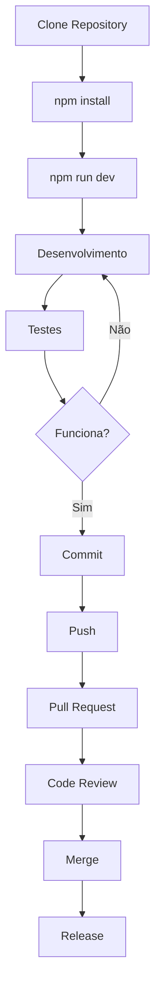

# 📁 Estrutura do Projeto BJ850 Hercules Clone

Este documento descreve a estrutura completa do projeto e serve como guia de navegação.

## 🌟 Visão Geral

O **BJ850 Hercules Clone** é uma aplicação Electron open-source que replica as funcionalidades do Hercules Setup Utility, especificamente otimizada para balanças industriais Jundiaí BJ-850 via conexão Ethernet TCP/IP.

## 📂 Estrutura de Arquivos

```
BJ850/
├── 📁 .github/                    # Configurações do GitHub
│   ├── 📁 ISSUE_TEMPLATE/         # Templates para issues
│   │   ├── bug_report.md          # Template para bugs
│   │   ├── feature_request.md     # Template para features
│   │   ├── documentation.md       # Template para docs
│   │   └── support.md             # Template para suporte
│   └── pull_request_template.md   # Template para PRs
│
├── 📁 src/                        # Código fonte da aplicação
│   ├── main.js                    # Processo principal Electron
│   ├── preload.js                 # Bridge IPC segura
│   ├── renderer.html              # Interface HTML
│   ├── renderer.js                # Lógica da interface
│   └── styles.css                 # Estilos CSS
│
├── 📁 assets/                     # Recursos da aplicação
│   └── icon.svg                   # Ícone principal
│
├── 📄 README.md                   # Documentação principal
├── 📄 TECHNICAL_GUIDE.md          # Guia técnico detalhado
├── 📄 CONTRIBUTING.md             # Guia para contribuidores
├── 📄 TEST_COMMANDS.md            # Comandos de teste
├── 📄 CHANGELOG.md                # Log de mudanças
├── 📄 SECURITY.md                 # Política de segurança
├── 📄 LICENSE                     # Licença MIT
├── 📄 .gitignore                  # Arquivos ignorados pelo Git
├── 📄 package.json                # Configurações do projeto
├── 📄 package-lock.json           # Lock de dependências
└── 🔧 build.sh                    # Script de build
```

## 📚 Documentação

### 📖 Documentos Principais

| Arquivo | Propósito | Público Alvo |
|---------|-----------|-------------|
| **README.md** | Introdução e guia de uso | 👥 Todos os usuários |
| **TECHNICAL_GUIDE.md** | Detalhes técnicos e configuração | 🔧 Técnicos e administradores |
| **CONTRIBUTING.md** | Guia para contribuidores | 👨‍💻 Desenvolvedores |
| **TEST_COMMANDS.md** | Comandos de teste e debug | 🧪 Testadores e desenvolvedores |
| **CHANGELOG.md** | Histórico de versões | 📋 Todos os usuários |
| **SECURITY.md** | Política de segurança | 🔒 Administradores e security |

### 🎯 Quick Links por Necessidade

#### 🆕 Usuários Iniciantes
1. 📖 **[README.md](README.md)** - Comece aqui
2. 🔧 **[TECHNICAL_GUIDE.md](TECHNICAL_GUIDE.md)** - Configuração da balança
3. 🆘 **[Issues](https://github.com/alexkads/BJ850/issues)** - Se precisar de ajuda

#### 👨‍💻 Desenvolvedores
1. 🤝 **[CONTRIBUTING.md](CONTRIBUTING.md)** - Como contribuir
2. 🧪 **[TEST_COMMANDS.md](TEST_COMMANDS.md)** - Comandos de desenvolvimento
3. 📋 **[CHANGELOG.md](CHANGELOG.md)** - Histórico de mudanças

#### 🔧 Administradores
1. 🔒 **[SECURITY.md](SECURITY.md)** - Configurações de segurança
2. 🔧 **[TECHNICAL_GUIDE.md](TECHNICAL_GUIDE.md)** - Setup avançado
3. 📊 **Monitoring** - (documentação futura)

## 💻 Código Fonte

### 🏗️ Arquitetura Electron

```
┌─────────────────┐    ┌─────────────────┐
│   Main Process  │    │ Renderer Process│
│   (main.js)     │◄──►│ (renderer.js)   │
│                 │IPC │                 │
│ • TCP Client    │    │ • UI Logic      │
│ • File System   │    │ • User Events   │
│ • OS APIs       │    │ • Data Display  │
└─────────────────┘    └─────────────────┘
         ▲                       ▲
         │                       │
    ┌─────────┐              ┌─────────┐
    │ Balança │              │  UI     │
    │ BJ-850  │              │(HTML/CSS)│
    └─────────┘              └─────────┘
```

### 📁 Detalhamento dos Arquivos

#### `src/main.js`
- **Função**: Processo principal do Electron
- **Responsabilidades**:
  - Gerenciar janelas da aplicação
  - Comunicação TCP/IP com balança
  - Handlers IPC
  - Comandos pré-definidos BJ-850

#### `src/preload.js`
- **Função**: Bridge segura entre main e renderer
- **Responsabilidades**:
  - Expor APIs seguras para o renderer
  - Context isolation
  - Comunicação IPC bidirecional

#### `src/renderer.html`
- **Função**: Interface principal da aplicação
- **Características**:
  - Design responsivo
  - Painéis organizados
  - Acessibilidade

#### `src/renderer.js`
- **Função**: Lógica da interface de usuário
- **Responsabilidades**:
  - Manipulação de eventos
  - Atualização da interface
  - Parsing de dados da balança
  - Gestão de logs

#### `src/styles.css`
- **Função**: Estilos da aplicação
- **Características**:
  - CSS Grid/Flexbox
  - Variáveis CSS
  - Design system consistente
  - Responsividade

## 🔧 Configuração e Build

### 📦 package.json

Contém todas as configurações do projeto:

```json
{
  "name": "bj850-hercules-clone",
  "version": "1.0.0",
  "scripts": {
    "start": "electron .",
    "dev": "electron . --dev",
    "build": "electron-builder"
  },
  "build": {
    "appId": "com.alexkads.bj850-hercules",
    "productName": "BJ850 Hercules Clone"
  }
}
```

### 🛠️ Scripts Disponíveis

| Comando | Descrição |
|---------|-----------|
| `npm start` | Executa aplicação em produção |
| `npm run dev` | Executa em desenvolvimento (com DevTools) |
| `npm run build` | Build para todas as plataformas |
| `npm run build-mac` | Build específico para macOS |
| `npm run build-win` | Build específico para Windows |
| `npm run build-linux` | Build específico para Linux |
| `./build.sh` | Script automatizado de build |

## 🎯 Fluxo de Desenvolvimento

### 🔄 Ciclo de Vida do Desenvolvimento



### 🧪 Processo de Teste

1. **Desenvolvimento Local**:
   ```bash
   npm run dev
   ```

2. **Teste de Conectividade**:
   ```bash
   ping 192.168.1.100
   telnet 192.168.1.100 4001
   ```

3. **Teste de Build**:
   ```bash
   npm run build
   ```

## 🌐 Integração GitHub

### 🎫 Sistema de Issues

O projeto usa templates para diferentes tipos de issues:

- 🐛 **Bug Report**: Para reportar problemas
- ✨ **Feature Request**: Para sugerir funcionalidades
- 📖 **Documentation**: Para melhorias na documentação
- 🤝 **Support**: Para perguntas e ajuda

### 🔄 Pull Requests

Template detalhado que inclui:
- Descrição das mudanças
- Como testar
- Checklist de desenvolvimento
- Impacto de segurança e performance

### 🏷️ Labels e Organização

- `bug` - Problemas confirmados
- `enhancement` - Novas funcionalidades
- `documentation` - Melhorias na documentação
- `good-first-issue` - Bom para iniciantes
- `help-wanted` - Precisa de ajuda da comunidade

## 🚀 Deployment e Distribuição

### 📦 Releases

Planos para releases automatizadas:

- **GitHub Releases**: Executáveis para download
- **Auto-update**: Sistema de atualização automática (futuro)
- **Package managers**: Chocolatey, Homebrew, AUR (futuro)

### 🌍 Plataformas Suportadas

| Plataforma | Status | Formato | Notas |
|-----------|--------|---------|-------|
| **Windows** | ✅ Suportado | `.exe`, `.msi` | Windows 10+ |
| **macOS** | ✅ Suportado | `.dmg`, `.app` | macOS 10.14+ |
| **Linux** | ✅ Suportado | `.AppImage`, `.deb`, `.rpm` | Ubuntu 18.04+ |

## 📊 Métricas e Estatísticas

### 📈 Atual (v1.0.0)

- **Linhas de código**: ~1,500
- **Arquivos fonte**: 5
- **Documentação**: 7 arquivos
- **Templates GitHub**: 5
- **Funcionalidades**: 12
- **Comandos suportados**: 6
- **Plataformas**: 3

### 🎯 Metas Futuras

- **Cobertura de testes**: 80%+
- **Documentação interativa**: 100%
- **Multi-idioma**: 3 idiomas
- **Performance**: < 2s startup
- **Memory usage**: < 100MB

## 🔮 Roadmap

### 📅 Próximas Versões

#### v1.1.0 - Usabilidade
- [ ] Configurações persistentes
- [ ] Modo escuro/claro
- [ ] Histórico de conexões
- [ ] Atalhos de teclado

#### v1.2.0 - Recursos Avançados
- [ ] Gráficos em tempo real
- [ ] Exportação de dados
- [ ] Múltiplas conexões
- [ ] API REST

#### v1.3.0 - Expansão
- [ ] Suporte a outras marcas
- [ ] Interface multi-idioma
- [ ] Detecção automática
- [ ] Plugins

## 💡 Como Contribuir

### 🎯 Áreas que Precisam de Ajuda

1. **🧪 Testes**: Implementar testes automatizados
2. **🌍 Tradução**: Adicionar suporte a outros idiomas
3. **📖 Documentação**: Melhorar e expandir docs
4. **🎨 Design**: Melhorar UI/UX
5. **🔧 Features**: Implementar funcionalidades do roadmap

### 🚀 Primeiros Passos

1. Leia **[CONTRIBUTING.md](CONTRIBUTING.md)**
2. Encontre uma **good-first-issue**
3. Comente na issue que pretende trabalhar
4. Faça fork do projeto
5. Desenvolva e teste
6. Envie Pull Request

---

## 📞 Suporte e Comunidade

### 🆘 Precisa de Ajuda?

- 📖 **Documentação**: Comece pelo README.md
- 🐛 **Bugs**: Abra uma issue com template de bug
- 💡 **Ideias**: Use template de feature request
- 💬 **Discussões**: GitHub Discussions
- 📧 **Contato**: Via issues ou discussions

### 🌟 Reconhecimento

Este projeto existe graças às contribuições da comunidade:

- **Usuários**: Reportando bugs e sugerindo melhorias
- **Desenvolvedores**: Contribuindo com código
- **Documentadores**: Melhorando a documentação
- **Testadores**: Validando funcionalidades

---

**💖 Obrigado por usar o BJ850 Hercules Clone!**

Para qualquer dúvida sobre a estrutura do projeto, consulte este documento ou abra uma issue.
