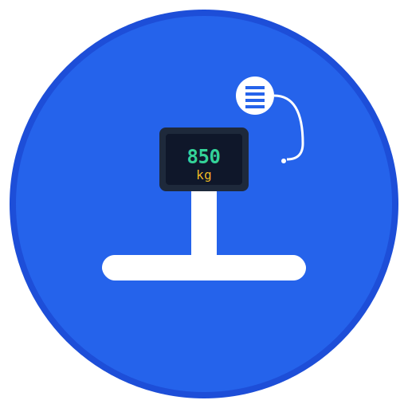

# 🏭 BJ850 Hercules Clone

<div align="center">



**Um clone open-source do Hercules Setup Utility especificamente desenvolvido para comunicação com a balança Jundiaí BJ-850 via conexão Ethernet.**

[](https://opensource.org/licenses/MIT)
[](https://electronjs.org/)
[](https://nodejs.org/)
[](https://github.com/alexkads/BJ850)

[📥 Download](#-instalação) • [📖 Documentação](#-documentação) • [🚀 Quick Start](#-quick-start) • [🤝 Contribuir](#-contribuição)

</div>

---

## 📖 Sobre o Projeto

O **BJ850 Hercules Clone** é uma aplicação desktop gratuita e open-source que replica as funcionalidades do popular Hercules Setup Utility, mas otimizada especificamente para trabalhar com balanças industriais **Jundiaí BJ-850** via conexão Ethernet TCP/IP.

### 🎯 Por que este projeto existe?

- **Gratuito**: Alternativa open-source ao software proprietário
- **Especializado**: Otimizado especificamente para balanças BJ-850
- **Moderno**: Interface moderna e responsiva
- **Multiplataforma**: Funciona em Windows, macOS e Linux
- **Extensível**: Código aberto para customizações


## ✨ Funcionalidades

<table>
<tr>
<td width="50%">

### 🌐 Conectividade
- **Conexão Ethernet TCP/IP** com balança BJ-850
- **Detecção automática** de status de conexão
- **Reconexão automática** em caso de falha
- **Configuração flexível** de IP e porta

### 📊 Interface Moderna
- **Design responsivo** e intuitivo
- **Monitor em tempo real** de dados
- **Log detalhado** com timestamps
- **Indicadores visuais** de status

</td>
<td width="50%">

### ⚡ Comandos Inteligentes
- **Botões pré-configurados** para comandos comuns
- **Envio manual** de comandos customizados
- **Suporte a formato hexadecimal**
- **Interpretação automática** de respostas

### 🔍 Monitoramento Avançado
- **Exibição de peso em tempo real**
- **Detecção de estados** (estável/instável)
- **Alertas de erro** (sobrecarga/subcarga)
- **Estatísticas de comunicação**

</td>
</tr>
</table>

### 🛠️ Comandos Suportados para BJ-850

| Comando | Ação | Código | Descrição |
|---------|------|--------|-----------|
| 📏 **Obter Peso** | `P\r\n` | Solicita peso atual | Retorna peso em kg/g |
| 🔄 **Zerar** | `Z\r\n` | Zera a balança | Define zero atual |
| ⚖️ **Tarar** | `T\r\n` | Executa tara | Remove peso do recipiente |
| 📊 **Status** | `S\r\n` | Status da balança | Estável/Instável |
| ℹ️ **Info** | `I\r\n` | Informações do dispositivo | Firmware/Versão |
| 🔄 **Reset** | `R\r\n` | Reset da balança | Reinicia sistema |

## � Quick Start

### 📋 Pré-requisitos

<table>
<tr>
<td width="33%">

**💻 Sistema**
- Windows 10+ / macOS 10.14+ / Linux
- 4GB RAM mínimo
- 100MB espaço livre

</td>
<td width="33%">

**🌐 Rede**
- Balança BJ-850 com Ethernet
- Mesma rede ou acesso IP
- Porta 4001 disponível

</td>
<td width="33%">

**🛠️ Desenvolvimento**
- Node.js 16+ ([Download](https://nodejs.org/))
- npm ou yarn
- Git (opcional)

</td>
</tr>
</table>

### 📥 Instalação

#### Opção 1: Download Executável (Recomendado)
```bash
# Em breve: releases com executáveis prontos
# GitHub Releases: https://github.com/alexkads/BJ850/releases
```

#### Opção 2: Compilar do Código Fonte
```bash
# 1. Clone o repositório
git clone https://github.com/alexkads/BJ850.git
cd BJ850

# 2. Instale dependências
npm install

# 3. Execute a aplicação
npm start
```

#### Opção 3: Build Personalizado
```bash
# Todas as plataformas
npm run build

# Específico por plataforma
npm run build-mac      # macOS (.app)
npm run build-win      # Windows (.exe)
npm run build-linux    # Linux (AppImage)

# Script automatizado
chmod +x build.sh
./build.sh
```

## 📖 Documentação

### 🔧 Configuração da Balança BJ-850

<details>
<summary><b>📡 Configuração de Rede (Clique para expandir)</b></summary>

#### Passo 1: Configurar IP da Balança
1. Acesse o menu de configuração da balança
2. Navegue para "Configurações de Rede" / "Network Settings"
3. Configure:
   - **IP fixo**: `192.168.1.100` (recomendado)
   - **Máscara**: `255.255.255.0`
   - **Gateway**: `192.168.1.1` (se aplicável)
   - **Porta TCP**: `4001`

#### Passo 2: Verificar Conectividade
```bash
# Testar conectividade
ping 192.168.1.100

# Testar porta TCP (Linux/macOS)
telnet 192.168.1.100 4001

# Windows
telnet 192.168.1.100 4001
```

#### Passo 3: Configurar Modo de Comunicação
- Modo: **Servidor TCP** (balança aguarda conexões)
- Protocolo: **ASCII**
- Terminador: **CR+LF** (`\r\n`)

</details>

### �️ Usando a Aplicação

<details>
<summary><b>🔌 Conectando à Balança (Clique para expandir)</b></summary>

1. **Abra a aplicação** BJ850 Hercules Clone
2. **Digite o IP** da balança no campo "Endereço IP"
   - Exemplo: `192.168.1.100`
3. **Digite a porta** (padrão: `4001`)
4. **Clique em "Conectar"**
5. **Aguarde** o status mudar para "Conectado" (indicador verde)

**Troubleshooting**:
- ❌ **Não conecta**: Verifique IP, rede e firewall
- ⚠️ **Timeout**: Balança pode estar ocupada ou configuração incorreta
- 🔄 **Reconectando**: Aguarde ou verifique cabo de rede

</details>

<details>
<summary><b>⚡ Comandos Rápidos (Clique para expandir)</b></summary>

### Botões Pré-configurados:

| Botão | Quando Usar | Resultado Esperado |
|-------|-------------|-------------------|
| 📏 **Obter Peso** | A qualquer momento | Exibe peso atual no painel |
| 🔄 **Zerar** | Plataforma vazia | Define novo ponto zero |
| ⚖️ **Tarar** | Com recipiente na balança | Remove peso do recipiente |
| 📊 **Status** | Verificar estabilidade | Mostra STABLE/UNSTABLE |
| ℹ️ **Info** | Verificar firmware | Exibe versão e modelo |
| 🔄 **Reset** | Em caso de erro | Reinicia balança |

### Interpretação de Respostas:

```
+00123.456 kg    ✅ Peso positivo estável
-00001.234 kg    ⚠️ Peso negativo (possível erro)
+00000.000 kg    ✅ Balança zerada
STABLE           ✅ Leitura estável
UNSTABLE         ⚠️ Leitura instável
OVERLOAD         ❌ Sobrecarga detectada
```

</details>

<details>
<summary><b>🛠️ Comandos Avançados (Clique para expandir)</b></summary>

### Envio Manual de Comandos:

1. **Digite o comando** no campo "Dados para enviar"
2. **Escolha o formato**:
   - **Texto**: Para comandos ASCII normais
   - **Hexadecimal**: Para comandos binários
3. **Marque "Adicionar CR+LF"** (recomendado)
4. **Clique "Enviar"**

### Comandos Especiais:

```bash
CAL               # Entrar modo calibração
CAL 1000          # Calibrar com peso de 1kg
UNIT KG           # Mudar unidade para quilogramas
UNIT G            # Mudar unidade para gramas
AUTO ON           # Ativar envio automático
AUTO OFF          # Desativar envio automático
FREQ 1000         # Frequência de envio (1000ms)
SAVE              # Salvar configurações
```

### Formato Hexadecimal:
```
50 0D 0A          # Comando P em hex (obter peso)
5A 0D 0A          # Comando Z em hex (zerar)
```

</details>

## 🐛 Solução de Problemas

<details>
<summary><b>❌ Problemas de Conexão</b></summary>

### Não consegue conectar à balança

**Verificações básicas:**
```bash
# 1. Testar conectividade de rede
ping 192.168.1.100

# 2. Verificar porta TCP
telnet 192.168.1.100 4001
# ou
nc -zv 192.168.1.100 4001

# 3. Verificar processos usando a porta
lsof -i :4001          # macOS/Linux
netstat -an | grep 4001 # Windows
```

**Possíveis soluções:**
- ✅ Verificar se balança está ligada
- ✅ Confirmar configuração de IP da balança
- ✅ Verificar cabos de rede
- ✅ Desativar firewall temporariamente
- ✅ Verificar se não há outro software conectado

</details>

<details>
<summary><b>📡 Problemas de Comunicação</b></summary>

### Conecta mas não recebe dados

**Diagnóstico:**
1. **Teste manual via telnet:**
   ```bash
   telnet 192.168.1.100 4001
   P<Enter>  # Deve retornar peso
   ```

2. **Verificar protocolo:**
   - Balança deve estar em modo **servidor TCP**
   - Protocolo deve ser **ASCII**
   - Comandos terminam com **CR+LF** (`\r\n`)

3. **Comandos de teste:**
   ```
   P         # Peso simples
   P\r\n     # Peso com terminadores
   \x50\x0D\x0A  # Peso em hexadecimal
   ```

</details>

<details>
<summary><b>🔤 Dados Incorretos ou Caracteres Estranhos</b></summary>

### Respostas com caracteres estranhos

**Possíveis causas:**
- Encoding incorreto (ASCII vs UTF-8)
- Protocolo binário misturado
- Configuração de baudrate (se usar serial)

**Soluções:**
1. **Use modo hexadecimal** para ver dados brutos
2. **Verifique manual da balança** para protocolo exato
3. **Teste diferentes terminadores:**
   - `\r\n` (padrão Windows)
   - `\n` (Unix/Linux)
   - `\r` (Mac clássico)

</details>

<details>
<summary><b>⚖️ Problemas com Peso</b></summary>

### Peso não atualiza automaticamente

**Configuração necessária na balança:**
```bash
AUTO ON       # Ativar envio automático
FREQ 1000     # Enviar a cada 1000ms
CONT ON       # Modo contínuo
STREAM ON     # Stream de dados (se suportado)
```

### Valores de peso inconsistentes

**Verificações:**
- Balança está estável? (sem vibração)
- Calibração está correta?
- Não há sobrecarga?
- Unidades estão corretas (kg vs g)?

</details>

<details>
<summary><b>💻 Problemas da Aplicação</b></summary>

### Aplicação não abre

```bash
# Verificar dependências
npm list

# Reinstalar dependências
rm -rf node_modules package-lock.json
npm install

# Verificar versão Node.js
node --version  # Deve ser 16+
```

### Aplicação lenta ou travando

**Otimizações:**
- Limpar log frequentemente
- Desativar auto-scroll se não necessário
- Verificar uso de memória no Task Manager

### Erro de permissões (macOS)

```bash
# Remover quarentena
xattr -d com.apple.quarantine BJ850-Hercules-Clone.app

# Dar permissões de execução
chmod +x build.sh
```

</details>

## 🤝 Contribuição

Contribuições são muito bem-vindas! Este é um projeto open-source mantido pela comunidade.

### 🌟 Como Contribuir

<table>
<tr>
<td width="50%">

**👥 Para Usuários**
- 🐛 Reportar bugs via [Issues](https://github.com/alexkads/BJ850/issues)
- 💡 Sugerir melhorias
- 📖 Melhorar documentação
- 🌍 Traduzir para outros idiomas
- ⭐ Dar uma estrela no projeto

</td>
<td width="50%">

**👨‍💻 Para Desenvolvedores**
- 🔧 Corrigir bugs
- ✨ Adicionar funcionalidades
- 🧪 Escrever testes
- 📊 Otimizar performance
- 🎨 Melhorar UI/UX

</td>
</tr>
</table>

### 🚀 Processo de Contribuição

1. **Fork** o projeto
2. **Clone** seu fork: `git clone https://github.com/seuusuario/BJ850.git`
3. **Crie uma branch**: `git checkout -b feature/amazing-feature`
4. **Faça suas alterações** e teste
5. **Commit**: `git commit -m 'Add amazing feature'`
6. **Push**: `git push origin feature/amazing-feature`
7. **Abra um Pull Request**

### � Diretrizes

- Mantenha o código limpo e comentado
- Teste suas alterações antes do PR
- Siga o padrão de commits convencionais
- Atualize documentação se necessário

### 🎯 Áreas que Precisam de Ajuda

- [ ] **Testes automatizados** (Jest, Cypress)
- [ ] **Suporte a outras balanças** (protocolos diferentes)
- [ ] **Interface multi-idioma** (i18n)
- [ ] **Gráficos em tempo real** (Chart.js)
- [ ] **Modo escuro** da interface
- [ ] **Configurações persistentes**
- [ ] **Exportação de dados** (CSV, Excel)
- [ ] **Detecção automática** de balanças na rede

## 📊 Roadmap

### 🔄 Versão Atual (1.0.0)
- ✅ Conexão TCP/IP básica
- ✅ Comandos pré-definidos BJ-850
- ✅ Interface moderna
- ✅ Monitor de dados em tempo real
- ✅ Parsing automático de peso

### 🎯 Próximas Versões

<details>
<summary><b>v1.1.0 - Melhorias de Usabilidade</b></summary>

- [ ] **Configurações persistentes** (salvar IP, porta, preferências)
- [ ] **Histórico de conexões** (IPs utilizados anteriormente)
- [ ] **Modo escuro/claro** da interface
- [ ] **Atalhos de teclado** para comandos rápidos
- [ ] **Notificações** de sistema para eventos importantes

</details>

<details>
<summary><b>v1.2.0 - Recursos Avançados</b></summary>

- [ ] **Gráficos em tempo real** de peso
- [ ] **Exportação de dados** (CSV, PDF, Excel)
- [ ] **Múltiplas conexões** simultâneas
- [ ] **Perfis de balança** (configurações por modelo)
- [ ] **API REST** para integração com outros sistemas

</details>

<details>
<summary><b>v1.3.0 - Expansão</b></summary>

- [ ] **Suporte a outras marcas** de balança
- [ ] **Detecção automática** de dispositivos na rede
- [ ] **Interface multi-idioma** (EN, ES, PT)
- [ ] **Plugins** para funcionalidades customizadas
- [ ] **Versão web** (Progressive Web App)

</details>

## 📄 Licença

Este projeto está licenciado sob a **Licença MIT** - veja o arquivo [LICENSE](LICENSE) para detalhes.

### 📝 Resumo da Licença MIT

```
✅ Uso comercial permitido
✅ Modificação permitida  
✅ Distribuição permitida
✅ Uso privado permitido
❌ Sem garantia
❌ Sem responsabilidade do autor
```

## 📞 Suporte e Comunidade

### 🆘 Obtendo Ajuda

| Tipo de Suporte | Canal | Tempo de Resposta |
|------------------|-------|-------------------|
| 🐛 **Bugs** | [GitHub Issues](https://github.com/alexkads/BJ850/issues) | 1-3 dias |
| 💡 **Dúvidas** | [GitHub Discussions](https://github.com/alexkads/BJ850/discussions) | 1-2 dias |
| 📖 **Documentação** | [Technical Guide](TECHNICAL_GUIDE.md) | Imediato |
| ⚡ **Quick Help** | [README](README.md) | Imediato |

### 🌐 Comunidade

- ⭐ **Estrela** no GitHub para apoiar o projeto
- 👀 **Watch** para receber notificações de atualizações
- 🍴 **Fork** para criar sua própria versão
- 📢 **Compartilhe** com outros que possam precisar

### 📧 Contato

Para questões específicas ou parcerias:
- 📫 **Issues**: Para bugs e sugestões técnicas
- 💬 **Discussions**: Para perguntas gerais e discussões
- 📖 **Wiki**: Documentação detalhada (em construção)

---

<div align="center">

**💖 Feito com amor para a comunidade industrial brasileira**

[⬆️ Voltar ao topo](#-bj850-hercules-clone)

</div>
